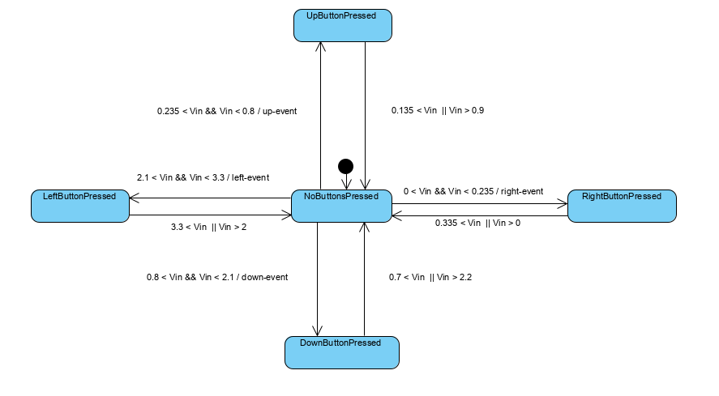
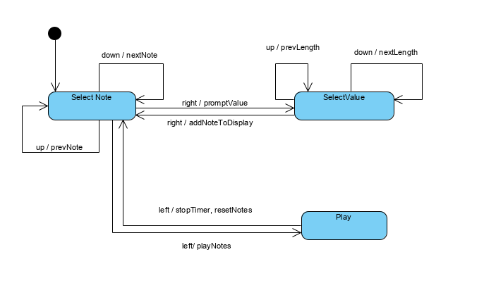

# Lab 8

This project was created and debugged using KeilMicroVision's software on the KL25Z freedom development board.
And ADC was used to poll the analog buttons. A speaker was used to produce a tune of a certain frequency and sound.
A 2 row, 16 characters LCD screen was used to display the information.

Speaker configuration:

Audio = PTA2
PWM = 3V3
+5V = P5V_USB
GND = GND

State Machines:

Task 1 Statem Machine

Task 1 Shows the polling of buttons:

NO_PRESS: the voltage detected by the ADC is 3.3 volts. When the voltage falls below a certain range the 
state changes to the corresponding pressed button. In the next cycle it checks if the voltage has fallen out of this range return to the NO PRESS.
Button debouncing is implemented with a delay of 50ms. 

Task 2

SELECT_NOTE: Up and down buttons select respectively the next and previous note, if the limit is reached the note is looped around the array.
The right button clears the bottom part of the display and moves to the SELECT_VALUE state.
The left button sets up the first note for playing and moves to the PLAY state.

SELECT_VALUE: Up and down buttons select respectively the next and previous length, if the limit is reached the length is looped around the array.
The right button confirms the note and length, stores it and add the note name it on the top row of the LCD, it moves to state SELECT_NOTE to play or propmpt for the next note.

PLAY: for every note it loads the PIT with the proper value, it loads its associated length in the time_count, it cycles through each note.
The left button stops the timer and deletes the previously stored notes, it moves back to the SELECT_NOTE state.
